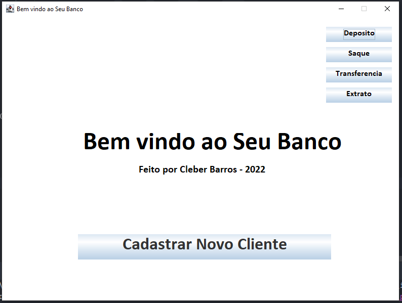
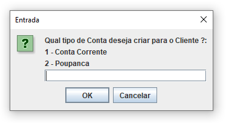

# Modulo 6   -  Java :coffee: 

Java é realmente uma tecnologia fantástica que abre um mundo novo de possibilidades para trabalhar com a criação de programas.

Neste desafio foi solicitado a criação de um sistema com características semelhantes ao que seria um sistema de banco digital.

Aproveitei para fazer um desafio pessoal e além de trabalhar na lógica e operação das funções, tentei implementar uma
GUI (Graphical User Interface) para tornar mais simples a utilização do programa.
Ainda será evoluído com imagem de background e demais melhorias

Agradecimentos à todo time da DIO pelos ensinamentos incríveis.

Abaixo algumas imagens do projeto:

